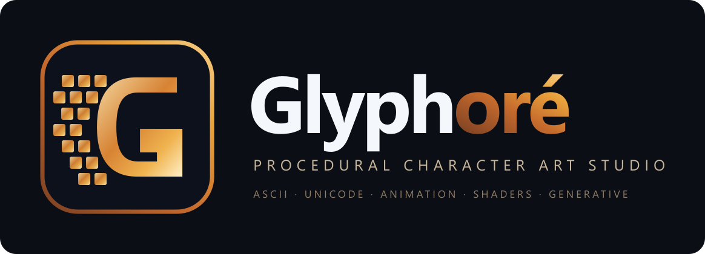

<p align="center">
  
</p>

# Glyphoré 6.0.0

Glyphoré is a native Linux procedural character-art studio for Arch and Arch-based distributions. It uses C#/.NET 10 and Avalonia 11; its animated preview is rendered inside Avalonia's native OpenGL lifecycle, using EGL or GLX provided by the running desktop session.

## Features

- Native Avalonia desktop UI (`MainWindow`)
- Native OpenGL preview (Avalonia `OpenGlControlBase` + Linux `NativeGl`)
- Full scene model (layers, masks, transform, post-process, presets, charsets, palettes)
- Multi-layer `.glyphore` scenes (format v9)
- Native file chooser, save dialog and clipboard
- TXT, HTML, ANSI, JSON, C# and PowerShell text export
- Self-contained `linux-x64` publishing and optional x86_64 AppImage

## Arch dependencies

Install the .NET 10 SDK to build or run from source. A working OpenGL driver and the usual `mesa` or vendor-driver stack plus `libglvnd` are required. Standard Arch X11 and Wayland installations normally include the needed graphical runtime.

```bash
sudo pacman -S dotnet-sdk mesa libglvnd
dotnet restore Glyphore/Glyphore.csproj
dotnet build Glyphore/Glyphore.csproj
dotnet run --project Glyphore/Glyphore.csproj
```

## Publish

```bash
./build-linux.sh
./build-linux.sh --appimage
```

The first command emits a self-contained binary at `publish/linux-x64/Glyphore`. The optional second command requires `appimagetool` and writes `dist/Glyphore-6.0.0-linux-x86_64.AppImage`.

## Scene compatibility

Scenes are versioned JSON files with the `.glyphore` extension. This Linux edition reads and writes v9 scene settings: scene name, dimensions, palette, charset, color mode, layers, visibility, opacity, seed, masks, transform and post-process.

## Port notes

Every source file from the Windows edition is present under `Glyphore/`. The Avalonia shell (`App`, `MainWindow`, `Program`) replaces WinForms entry points. WinForms-only UI (`MainForm*`, `Controls/`, forms, smoke tests, WGL `GlPreviewControl` partials, named-pipe Discord IPC) remains on disk as retained source and is excluded from the Avalonia compile (`Compile Remove` / `*.WinForms.cs`). `NativeGl` loads GL via Avalonia's `GetProcAddress` (GLX/EGL); obsolete WGL stubs throw `PlatformNotSupportedException`.

## Licencia

El código fuente de Glyphoré está publicado bajo la [licencia MIT](LICENSE).
